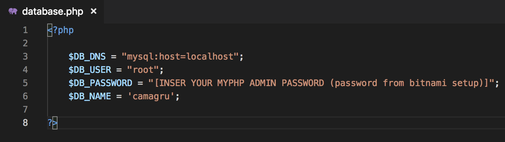
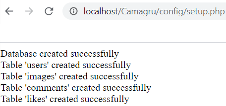
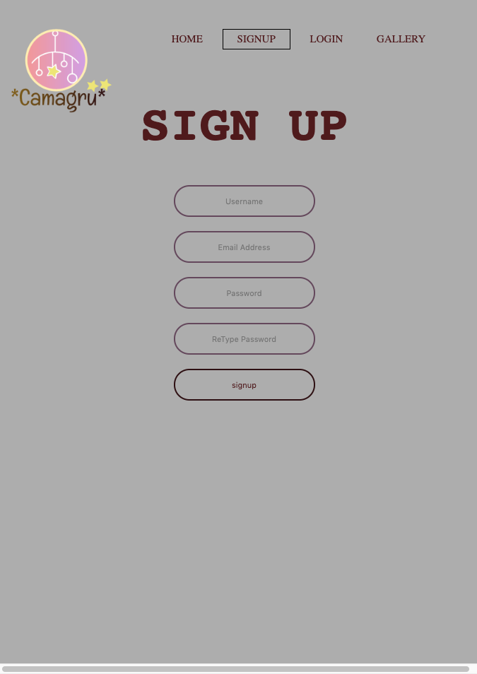

 # Camagru

Camagru is an Instagram-like website. It allows you to take pictures with your webcam or upload one, and add beautiful filters on it.

It is the first Web Project of WeThinkCode_

# Installation

## Prerequisites

A local apache server to host on, in this case we will make use of bitnami local server environments

   - [Bitnami local server environments](https://bitnami.com/stacks/infrastructure)
   
### MacOS

 - Install [Bitnami MAMP](https://bitnami.com/stack/mamp)

### Windows

 - Install [Bitnami WAMP](https://bitnami.com/stack/wamp)

### Linux

> NOTE - this project hasn't been tested on a linux based system

 - Install [Bitnami LAMP](https://bitnami.com/stack/lamp)


# Clone

Clone this repo to your local machine using:

```
cd [Insert path to your MAMP/ WAMP / LAMP Directory ]/apache2/htdocs
git clone https://github.com/PollySambo/Camagru-seta
```

# Setup
## Configuring Server Environment

# Setup
## Configuring Server Environment

Locate and run the executable file


Start the server


Browse to site location
http://localhost/Camagru
> NOTE - by default the server is set to port 80  or 81 

## Configuring Camagru

### Changing Camagru Variables 

In [Insert path to your MAMP/ WAMP / LAMP Directory ]/apache2/htdocs/Camagru/config/database.php  

Change the password of `$DB_PASSWORD`, to the password chosen during from bitnami setup.



### Creating Database and Tables

To create database and tables:  

In the browser, navigate to  
http://localhost/Camagru/config/setup.php  



## Authors

  > **Polite Sambo** - *Student @* - [WeThinkCode_](https://github.com/PollySambo)

# Samples | Screenshots

## Home Page


## Sign Up Page



## Gallery Page

.png)


# Project insight

## Project Brief
- [Camagru Project Brief](./images/github/camagru.en.pdf)

## ## Project Markingsheet | Project Testing
- [Camagru Project Marking sheet](./images/github/camagru.markingsheet.pdf)


## Project Stack / Technologies
### Front-End
- HTML
- CSS
- Javascript

### Back-End
- [PHP](https://www.php.net/)
  
### Databse
- [MySQL](https://www.mysql.com/)
- [phpMyAdmin](https://www.phpmyadmin.net/)

## References | Attributes  
- [Stickers and Icons - just gifs](https://www.justgags.com)


## Project File Structure
